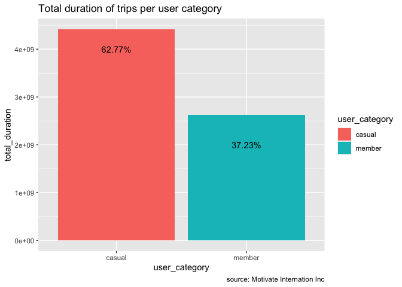
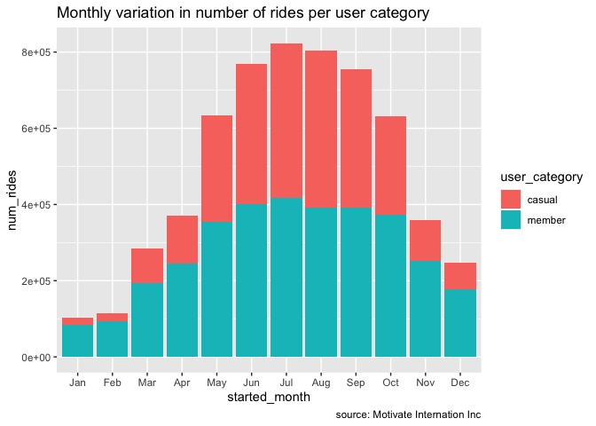

GDA_Capstone_Project_Aug2022
================

``` r
# capture all the libraries here for ease of review)
library(tidyverse)
```

    ## ── Attaching packages ─────────────────────────────────────── tidyverse 1.3.2 ──

    ## ✓ ggplot2 3.3.6     ✓ purrr   0.3.4
    ## ✓ tibble  3.1.6     ✓ dplyr   1.0.7
    ## ✓ tidyr   1.1.4     ✓ stringr 1.4.0
    ## ✓ readr   2.1.1     ✓ forcats 0.5.1

    ## ── Conflicts ────────────────────────────────────────── tidyverse_conflicts() ──
    ## x dplyr::filter() masks stats::filter()
    ## x dplyr::lag()    masks stats::lag()

``` r
library(lubridate)
```

    ## 
    ## Attaching package: 'lubridate'

    ## The following objects are masked from 'package:base':
    ## 
    ##     date, intersect, setdiff, union

``` r
library(here)
```

    ## here() starts at /Users/peterjoseph/Documents/MBA/Google Data Analysis/Capstone/Portfolio-Project/Portfolio-Project

``` r
library(skimr)
library(janitor)
```

    ## 
    ## Attaching package: 'janitor'

    ## The following objects are masked from 'package:stats':
    ## 
    ##     chisq.test, fisher.test

``` r
library(geosphere)
#knitr::opts_chunk$set(echo = FALSE)
```

## Introduction

This project provides analysis of the previous 12-month of bike-share
data. As a company, Cyclist has more than 5800 bicycles available for
casual riders and members of Cyclist annual subscription program.

#### 1. Business Task

The business objectives of this analysis is to provide supporting
analysis to help the management design the most effective marketting
strategy which is key to the future growth of the company.

-   Determine whether annual members and casual riders use bikes
    differently?

-   Establish the condition or justification for casual riders to buy
    annual membership?

-   Determine the possibility of using digital media to influence casual
    riders to become members?

#### 2. Stakeholders

The key stakeholders and roles are outlined in the table below.

``` r
tibble::tibble("Stakeholders"=c("Cyclistic Executive Team", "Cyclistic Marketing Analytics Team","Lily Morano, Director of Marketing"),"Roles"=c(
  "Responsible for the approval of the recommended marketing strategy",
"Team of data analyst that can provide peer review of the project",
"Responsible for the development of campaigns and initiatives")) %>% 
knitr::kable(caption = "Key Stakeholders")
```

| Stakeholders                       | Roles                                                              |
|:-----------------------------------|:-------------------------------------------------------------------|
| Cyclistic Executive Team           | Responsible for the approval of the recommended marketing strategy |
| Cyclistic Marketing Analytics Team | Team of data analyst that can provide peer review of the project   |
| Lily Morano, Director of Marketing | Responsible for the development of campaigns and initiatives       |

Key Stakeholders

#### 3. Data Source

-   **Data Source:** Motivate Internation Inc.

-   Data downloaded on 2022-08-28

-   Data downloaded from
    <https://divvy-tripdata.s3.amazonaws.com/index.html>

-   The dataset is reported to be reliable and appropriate to be
    analysed. I will carry out further checks to confirm.

-   I have monthly data of bike share from Aug 2021 to July 2022
    available as at the time that I downloaded the data.

I reviewed each monthly data and carried out the following checks:

-   Compare the **column names to check for consistency** before merging
    them together.

    -   **Outcome:** Columns labels are consistent in all the files.

-   Check **correctness and consistency** of Character types.

    -   **Outcome:** Data types are consistent and correct.

-   Check the **uniqueness** of the primary key: **ride_id**.

    -   **Outcome:** No duplicate in the primary key.

-   Check the **completeness** of the data.

    -   **Outcome:** There are NAs values in some columns in all the
        files. I will address this issue after merging the files.

-   After completing the review of individual files, I **combined the
    monthly data to get the last 12-month trips**.

``` r
trips_12months <- dplyr::bind_rows(tripdata_0722,tripdata_0622,tripdata_0522,tripdata_0422,
tripdata_0322,tripdata_0222,tripdata_0122,tripdata_1221,tripdata_1121,tripdata_1021,tripdata_0921,tripdata_0821)

trips_12months <- tibble::as_tibble(trips_12months)
```

-   The table below is a sample of the combined dataset.

``` r
tail(trips_12months) %>% 
  knitr::kable(caption="sample of bikeshare dataset")
```

| ride_id          | rideable_type | started_at          | ended_at            | start_station_name       | start_station_id | end_station_name            | end_station_id | start_lat | start_lng |  end_lat |   end_lng | member_casual |
|:-----------------|:--------------|:--------------------|:--------------------|:-------------------------|:-----------------|:----------------------------|:---------------|----------:|----------:|---------:|----------:|:--------------|
| 2D6861BE1B6741CF | classic_bike  | 2021-08-07 10:52:09 | 2021-08-07 10:58:09 | Paulina Ave & North Ave  | TA1305000037     | Leavitt St & North Ave      | TA1308000005   |  41.90985 | -87.66993 | 41.91051 | -87.68239 | member        |
| 5E5C9CD681E0419C | classic_bike  | 2021-08-07 18:07:43 | 2021-08-07 18:21:21 | Wells St & Evergreen Ave | TA1308000049     | Lincoln Ave & Diversey Pkwy | TA1307000064   |  41.90672 | -87.63483 | 41.93223 | -87.65862 | member        |
| 96FB57CF4AA456F6 | electric_bike | 2021-08-09 08:49:31 | 2021-08-09 09:03:51 | Broadway & Sheridan Rd   | 13323            | Clark St & Lincoln Ave      | 13179          |  41.95271 | -87.64994 | 41.91597 | -87.63476 | member        |
| 226A0910DCCE904C | classic_bike  | 2021-08-12 16:55:57 | 2021-08-12 17:15:10 | Dearborn St & Adams St   | TA1305000005     | Clark St & Lincoln Ave      | 13179          |  41.87936 | -87.62979 | 41.91569 | -87.63460 | member        |
| 1A97D27AE23DE1E7 | classic_bike  | 2021-08-08 22:47:43 | 2021-08-08 23:08:12 | Broadway & Sheridan Rd   | 13323            | Clark St & Winnemac Ave     | TA1309000035   |  41.95283 | -87.64999 | 41.97335 | -87.66786 | casual        |
| BBC36E4AA3652361 | electric_bike | 2021-08-27 18:53:53 | 2021-08-27 19:02:16 | Paulina Ave & North Ave  | TA1305000037     | Dayton St & North Ave       | 13058          |  41.90985 | -87.66981 | 41.91067 | -87.64955 | casual        |

sample of bikeshare dataset

check the following:

-   Check the uniqueness of the primary key: *ride_id*.

    -   **outcome:** no duplicate in the primary key of the combined
        dataset.

-   High level summary of data. Check for incomplete data

``` r
skimr::skim_without_charts(trips_12months)
```

|                                                  |                |
|:-------------------------------------------------|:---------------|
| Name                                             | trips_12months |
| Number of rows                                   | 5901463        |
| Number of columns                                | 13             |
| \_\_\_\_\_\_\_\_\_\_\_\_\_\_\_\_\_\_\_\_\_\_\_   |                |
| Column type frequency:                           |                |
| character                                        | 7              |
| numeric                                          | 4              |
| POSIXct                                          | 2              |
| \_\_\_\_\_\_\_\_\_\_\_\_\_\_\_\_\_\_\_\_\_\_\_\_ |                |
| Group variables                                  | None           |

Data summary

**Variable type: character**

| skim_variable      | n_missing | complete_rate | min | max | empty | n_unique | whitespace |
|:-------------------|----------:|--------------:|----:|----:|------:|---------:|-----------:|
| ride_id            |         0 |          1.00 |  16 |  16 |     0 |  5901463 |          0 |
| rideable_type      |         0 |          1.00 |  11 |  13 |     0 |        3 |          0 |
| start_station_name |    860786 |          0.85 |   3 |  64 |     0 |     1381 |          0 |
| start_station_id   |    860784 |          0.85 |   3 |  44 |     0 |     1226 |          0 |
| end_station_name   |    919896 |          0.84 |   9 |  64 |     0 |     1396 |          0 |
| end_station_id     |    919896 |          0.84 |   3 |  44 |     0 |     1236 |          0 |
| member_casual      |         0 |          1.00 |   6 |   6 |     0 |        2 |          0 |

**Variable type: numeric**

| skim_variable | n_missing | complete_rate |   mean |   sd |     p0 |    p25 |    p50 |    p75 |   p100 |
|:--------------|----------:|--------------:|-------:|-----:|-------:|-------:|-------:|-------:|-------:|
| start_lat     |         0 |             1 |  41.90 | 0.05 |  41.64 |  41.88 |  41.90 |  41.93 |  45.64 |
| start_lng     |         0 |             1 | -87.65 | 0.03 | -87.84 | -87.66 | -87.64 | -87.63 | -73.80 |
| end_lat       |      5590 |             1 |  41.90 | 0.05 |  41.39 |  41.88 |  41.90 |  41.93 |  42.37 |
| end_lng       |      5590 |             1 | -87.65 | 0.03 | -88.97 | -87.66 | -87.64 | -87.63 | -87.50 |

**Variable type: POSIXct**

| skim_variable | n_missing | complete_rate | min                 | max                 | median              | n_unique |
|:--------------|----------:|--------------:|:--------------------|:--------------------|:--------------------|---------:|
| started_at    |         0 |             1 | 2021-08-01 00:00:04 | 2022-07-31 23:59:58 | 2022-02-14 14:10:08 |  4923992 |
| ended_at      |         0 |             1 | 2021-08-01 00:03:11 | 2022-08-04 13:53:01 | 2022-02-14 14:20:23 |  4928247 |

``` r
unknown <- names(which(colSums(is.na(trips_12months))>0))
```

-   There are unknown values. Majority of the unkown values are in the
    following columns **start_station_name, start_station_id,
    end_station_name, end_station_id with a total null values of
    3561362.**

-   The remaining null values are in the columns **end_lat, end_lng,
    with a total null values of 11180.**

## Data Cleaning and Manipulation

-   The reason for the null values are unknown. However, we know that
    the ride_id are unique for all entries. Moreover, we have complete
    data in the start_time and end_time columns.I will **replace all the
    null values with character string “unknown” in the following columns
    start_station_name, start_station_id, end_station_name,
    end_station_id.**

``` r
trips_clean <- trips_12months %>% 
  tidyr::replace_na(list(start_station_name="unknown",
                         start_station_id="unknown",
                         end_station_name="unknown",
                         end_station_id="unknown")) %>% 
  dplyr::rename(user_category = member_casual) 
```

I did a quick check to that sure that the data do no longer contain NAs
in these **start_station_name, start_station_id, end_station_name,
end_station_id.**.

However, there are still NAs in the **end_lat and end_lng**. I will
address this issue next.

-   The trips with NAs values in end_lat and end_lon has actual trip
    duration. Unfornately, I am not sure why the NAs values are
    reported. I will replace the NAs values with start_lat and start_lng
    respectively. This will set the distance between the start and end
    as zero for these locations (NAs) only. I think this is better than
    leaving the NAs values in those 2 columns.

-   Final check after replacing remaining NAs.

    -   **Outcome:** No NAs in the dataset.

-   Add a new attribute that will show the duration of each trip in
    seconds

-   Sort dataset with the started_at date column

-   Add two additional attributes start_day and start_month labels

-   Add a new attribuate that calculate the distance for each trip from
    the latitude and longitude points

## Summary of Analysis

**1. Review the number, duration and distance of trips by Casual Riders
and Annual Members with a bar chart.**

``` r
trips_clean %>% 
ggplot2::ggplot(aes(x=user_category,fill=user_category))+ggplot2::geom_bar()+ggplot2::labs(title = "Number of trips per user category",caption = "source: Motivate Internation Inc")
```

<!-- -->

-   There are more reported trips by members versus trips by casual
    users in the previous 12 months. Annual members embark on more trips
    over the previous 12-months compared to the Casual Riders.

However, a good indication of the accrued revenue from these trips would
be the distance covered or duration of the trip. **The duration and
distance of the trips can give us the indication of revenue earned from
these trips.**

``` r
trip_sum <- trips_clean %>%
  dplyr::group_by(user_category) %>% 
  dplyr::summarise(total_duration = sum(duration_secs)) 
trip_sum <- trip_sum %>% 
  dplyr::mutate(percent_trip =  sprintf("%1.2f%%",100*(as.double(total_duration) / as.double(sum(total_duration))))) 

label1 = as.character(trip_sum$percent_trip[1])
label2 = as.character(trip_sum$percent_trip[2])

trip_sum %>% 
  ggplot2::ggplot(aes(x=user_category,y=total_duration,fill=user_category))+ggplot2::geom_col()+ggplot2::labs(title = "Total duration of trips per user category",caption = "source: Motivate Internation Inc") + ggplot2::annotate("text",y=4e9,x="casual",label=label1) + ggplot2::annotate("text",y=2e9,x="member",label=label2) + ggplot2::scale_y_continuous()
```

<!-- -->

-   Casual bike rider makes up 62.77% of the total duration of all trips
    in the last 12 months with subscribed members proportion of total
    duration only 37.23%. **This shows the importance of casual bike
    rider to the total revenue of the firm.**

``` r
trip_sum1 <- trips_clean %>%
  dplyr::group_by(user_category) %>% 
  dplyr::summarise(total_distance = sum(distance_trip)) 


trip_sum1 %>% 
  ggplot2::ggplot(aes(x=user_category,y=total_distance,fill=user_category))+ggplot2::geom_col()+ggplot2::labs(title = "Total distance (m) of trips per user category",caption = "source: Motivate Internation Inc") 
```

<!-- -->

-   Casual users travel shorter distance compared to annual members.This
    an interesting observation. However, I need to review the average
    distance covered per user as well (i.e. average distance per trip).

*Note: Unfortunately, The replaced NAs in the end_lat and end_lon
attributes might have some impact on the calculated distance.*

**2. Review the duration of trips by user_category and rideable_type
with a bar chart to see if there is rideable_type prefered by casual
riders compared to annual members.**

``` r
trip_sum <- trips_clean %>%
  dplyr::group_by(user_category, rideable_type) %>% 
  dplyr::summarise(total_duration = sum(duration_secs),.groups = "drop_last") 
trip_sum <- trip_sum %>% 
  dplyr::mutate(percent_trip =  sprintf("%1.2f%%",100*(as.double(total_duration) / as.double(sum(total_duration))))) 


trip_sum %>% 
  ggplot2::ggplot(aes(x=user_category,y=percent_trip,fill=user_category))+ggplot2::geom_col()+ ggplot2::facet_wrap(~rideable_type)+ggplot2::labs(title = "Percent duration of trips per user category per ride_type",caption = "source: Motivate Internation Inc") 
```

<!-- -->

-   It is interesting that **only casual riders are using the
    docked_bike category**.I need to investigate this further. *Is this
    a unique ride_type or a mis-classification?* If the data is
    representative, then there is an opportunity to explore how to
    convert the docked_bike casual riders to member.

**3. Review whether there is (montly and daily) variation in Casual and
annual members trip duration.**

``` r
trips_clean %>% 
  dplyr::group_by(user_category,started_month) %>% 
  dplyr::summarise(num_rides = n(),.groups = "drop_last") %>% 
  ggplot2::ggplot(aes(x=started_month,y=num_rides,fill=user_category))+ggplot2::geom_col()+ggplot2::labs(title = "Monthly variation in number of rides per user category",caption = "source: Motivate Internation Inc")
```

<!-- -->

-   We can also plot a time-series of the same trend.

``` r
trips_clean %>% 
  dplyr::mutate(start_date= as.Date(started_at)) %>% 
  dplyr::group_by(user_category,start_date) %>% 
  dplyr::summarise(num_rides = n(),.groups="keep") %>% 
    ggplot2::ggplot(aes(x=start_date,y=num_rides,color=user_category))+ggplot2::geom_smooth(method="loess",se=FALSE,formula=y~x)+ggplot2::labs(title = "Smoothed Time Series of the variation in number of rides per user category",caption = "source: Motivate Internation Inc")
```

<!-- -->

Recall that the period analysed is from Aug 2021 to July 2022.

-   **Majority of the bike rides occur in the months of May to Oct.**
    This is likely to be due to the **warmer weather** during that time
    of the year i.e. late spring, early summer and early fall. This
    observation is consistent with the trend in the smoothed time series
    plot.

-   The proportion of bike riders is higher for annual members in the
    colder months of Nov, Dec, Jan - April. **It is already reported
    that some members are using the bike to commute to their place of
    work possibly throughout the year.**

``` r
df<- trips_clean %>% 
  dplyr::group_by(user_category,started_day) %>% 
  dplyr::summarise(num_rides = n(),.groups = "drop_last") 
df1 <- df %>% 
 dplyr::mutate(percent_rides =  sprintf("%1.2f%%",100*(as.double(num_rides) / as.double(sum(num_rides))))) 

 df1%>% 
  knitr::kable(caption = "Summarized Daily Variation in number and percent of rides")
```

| user_category | started_day | num_rides | percent_rides |
|:--------------|:------------|----------:|:--------------|
| casual        | Sun         |    475626 | 18.86%        |
| casual        | Mon         |    299656 | 11.88%        |
| casual        | Tue         |    273826 | 10.86%        |
| casual        | Wed         |    281783 | 11.17%        |
| casual        | Thu         |    316118 | 12.53%        |
| casual        | Fri         |    347642 | 13.78%        |
| casual        | Sat         |    527575 | 20.92%        |
| member        | Sun         |    417978 | 12.37%        |
| member        | Mon         |    472392 | 13.98%        |
| member        | Tue         |    523387 | 15.49%        |
| member        | Wed         |    522648 | 15.47%        |
| member        | Thu         |    522662 | 15.47%        |
| member        | Fri         |    466680 | 13.81%        |
| member        | Sat         |    453490 | 13.42%        |

Summarized Daily Variation in number and percent of rides

``` r
df%>% 
ggplot2::ggplot(aes(x=started_day,y=num_rides,fill=user_category))+geom_col()+labs(title = "Daily variation in number of rides per user category",caption = "source: Motivate Internation Inc")
```

<!-- -->

-   Casual riders use the bike more on **(sunday: 18.86%, and saturday:
    20.92%)** compared to each of the other days.

-   Annual members predominantly use the bike during the week **i.e. Mon
    to Fri (74.21%)** compared to weekend (25.79%)

**3. We can summarize the duration and distance in a table for ease of
comparison.**

``` r
trips_clean %>% 
  dplyr::group_by(user_category) %>% 
  dplyr::summarise("Average distance"= mean(distance_trip), "Total distance"=sum(distance_trip),"Average duration"= mean(as.double(duration_secs)), "Total duration"=sum(as.double(duration_secs))) %>% 
  knitr::kable(caption="aggregation of distance and duration of trips by user category") 
```

| user_category | Average distance | Total distance | Average duration | Total duration |
|:--------------|-----------------:|---------------:|-----------------:|---------------:|
| casual        |         1532.251 |     3864683772 |        1752.6754 |     4420643395 |
| member        |         1455.291 |     4917771990 |         775.9218 |     2622023515 |

aggregation of distance and duration of trips by user category

-   The observed trend is consistent with previously noted trend of
    **casual users traveling over higher total duration but shorter
    total distance compared to annual members. However, average duration
    and average distance are higher for casual riders vs annual
    members.**

**Finally, we can export the clean data for futher analysis.**

``` r
readr::write_csv(trips_clean,"clean_bikeshare.csv")
```

## Summary of Findings

1.  The identified differences between Casual Riders and Annual Members
    are:

-   Casual riders are more like to use the bike share during the warmer
    months (May to Oct).

-   There are significant less Casual riders in the colder months
    compared to Annual Members.

-   The average duration and distance of Casual Riders is more than
    those of Annual Members.

-   Casual riders use the bike share more on Saturday and Sunday
    compared to each of the other days.

-   Annual members use the bike significantly more on weekdays compared
    to weekend.

-   It can be inferred that Annual Members are more likely to use the
    bike to commute to work compared to casual riders.

-   According to the data, only Casual riders are using the Docked bike
    type.However, this is likely due to misclassification or erroneuous
    entry.

2.  The conditions or justifications for Casual members to buy annual
    membership are:

-   There must be a price/cost justification for casual riders to buy a
    full year membership because

        (a) Casual riders are more likely to use the bike during the warmer months.

        (b) Casual riders are more likely to ride the bike leisurely.

3.  One way that digital media can be used to influence the casual
    riders to become annual members is by rolling out advertising
    campaigns that would highlight the health benefits of riding bikes
    throughout the years.

-   If more casual members can use the bike to commute to work and other
    places, then they would see the cost advantage of annual membership.

## Top Three Recommendations

1.  Create more **flexible categories of membership such as monthly,
    quarterly and fixed-period** because Casual riders use the bike
    mostly during the warmer months for leisure purpose.

2.  Create a **marketing campaigns showing the health benefit of riding
    bikes more often than just for leisure purpose.** This can be based
    on a health survey or study comparing the health benefit of an
    occasional casual riders with those of a consistent annual member.

3.  Create a marketing campaign highlighting the **environmental
    friendliness of bikes versus other mode of transportation.** This
    could potentially attract environmental conscious casual member to
    buy annual membership.
